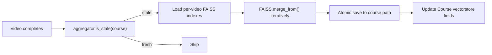

# Standalone AI Video Engine — Implementation Plan

> **Goal**: Extract AI video engine features from the existing Punar-Synaptics Django codebase and rebuild them as a standalone, API-first Django application.

---

## 1. Codebase Extraction Map

### 1.1 Models

| Component | File | Lines | Description |
|---|---|---|---|
| `LiveCourse` | [models.py](file:///home/ricky/VScode/projects/python/Django/Punar-Synaptics/punar_lms/punarcourses/models.py#L2316-L2416) | 2316–2416 | Course container with vectorstore fields (`course_vectorstore_path`, `course_vectorstore_created`, `course_vectorstore_updated_at`) and denormalized stats |
| `LiveVideo` | [models.py](file:///home/ricky/VScode/projects/python/Django/Punar-Synaptics/punar_lms/punarcourses/models.py#L2418-L2560) | 2418–2560 | Individual video with Vimeo info, file paths (`video_file`, `audio_file`, `transcript_file`), vectorstore fields, processing tracking |
| `LiveVideoProcessingJob` | [models.py](file:///home/ricky/VScode/projects/python/Django/Punar-Synaptics/punar_lms/punarcourses/models.py#L2562-L2728) | 2562–2728 | Job lifecycle tracking with status, progress, error, retry, webhook fields, and helper methods (`mark_started`, `mark_completed`, `mark_failed`, `update_progress`) |

### 1.2 Services / Processing Logic

| Component | File | Lines | Description | Key Dependencies |
|---|---|---|---|---|
| `LiveVideoProcessor` | [live_video_processor.py](file:///home/ricky/VScode/projects/python/Django/Punar-Synaptics/punar_lms/api/live_video_processor.py) | 1–539 | Full pipeline: download → extract audio → transcribe → embed → vectorstore. Also contains `process_video_job()` orchestrator | `VimeoYtDlpDownloader`, `AudioTranscriptionUtils`, `HybridGraphRAGV2`, `LLMContextHelper` |
| `VimeoDownloader` | [vimeo_ytdlp_downloader.py](file:///home/ricky/VScode/projects/python/Django/Punar-Synaptics/yt_transcribe/vimeo_ytdlp_downloader.py) | 1–468 | Vimeo API token-based download, video ID extraction, metadata fetch | `requests` only |
| `AudioTranscriptionUtils` | `course_creator_tools/audio_transcription_utils.py` | — | Audio extraction (ffmpeg) + Whisper transcription | `openai`, `ffmpeg` |
| `HybridGraphRAGV2` | [hybrid_graph_v2_api.py](file:///home/ricky/VScode/projects/python/Django/Punar-Synaptics/yt_transcribe/hybrid_graph_v2_api.py) | — | Initializes LLM, embeddings, text_splitter for vectorstore creation | `langchain_openai` |
| `LLMContextHelper` | `yt_transcribe/src/llm_context_helper.py` | — | `get_vector_store_transcript_v2()` — chunks transcript, creates FAISS vectorstore | `langchain`, `faiss` |
| `LiveVideoQuestionService` | [live_video_services.py](file:///home/ricky/VScode/projects/python/Django/Punar-Synaptics/punar_lms/api/live_video_services.py#L14-L300) | 14–300 | Loads FAISS vectorstore, runs `ConversationalRetrievalChain` with GPT-4o-mini for video-level QA. Includes guardrails check | `langchain_community.vectorstores.FAISS`, `langchain_openai`, `langchain_classic.chains` |
| `LiveCourseQuestionService` | [live_video_services.py](file:///home/ricky/VScode/projects/python/Django/Punar-Synaptics/punar_lms/api/live_video_services.py#L303-L363) | 303–363 | Course-level QA — resolves course vectorstore path, delegates to `LiveVideoQuestionService` | `LiveCourse` model |
| `CourseVectorstoreBuilder` | [live_course_vectorstore_builder.py](file:///home/ricky/VScode/projects/python/Django/Punar-Synaptics/punar_lms/api/live_course_vectorstore_builder.py) | 1–291 | Merges per-video FAISS indexes via `FAISS.merge_from()`, atomic save with temp dir, staleness check | `langchain_community.vectorstores.FAISS`, `langchain_openai` |

### 1.3 API Views

| Endpoint | View Class | File | Lines | Method |
|---|---|---|---|---|
| `POST /api/live-courses/` | `LiveCourseListCreateAPI` | [views.py](file:///home/ricky/VScode/projects/python/Django/Punar-Synaptics/punar_lms/api/views.py#L1675-L1782) | 1675–1782 | `post` — create course |
| `GET /api/live-courses/` | `LiveCourseListCreateAPI` | same | same | `get` — list courses |
| `POST /api/live-courses/{id}/videos/` | `LiveVideoListCreateAPI` | [views.py](file:///home/ricky/VScode/projects/python/Django/Punar-Synaptics/punar_lms/api/views.py#L1867-L2036) | 1867–2036 | `post` — add video(s), creates `LiveVideoProcessingJob` |
| `POST /api/live-video-question/` | `LiveVideoQuestionAPI` | [views.py](file:///home/ricky/VScode/projects/python/Django/Punar-Synaptics/punar_lms/api/views.py#L2329-L2512) | 2329–2512 | Video-level QA |
| `POST /api/live-course-question/` | `LiveCourseQuestionAPI` | [live_course_views.py](file:///home/ricky/VScode/projects/python/Django/Punar-Synaptics/punar_lms/api/live_course_views.py#L97-L222) | 97–222 | Course-level QA |
| `POST /api/live-course/vectorstore-status/` | `LiveCourseVectorstoreStatusAPI` | [live_course_views.py](file:///home/ricky/VScode/projects/python/Django/Punar-Synaptics/punar_lms/api/live_course_views.py#L28-L94) | 28–94 | Video + course vectorstore status |
| `GET /api/live-videos/{id}/processing-status/` | `VideoProcessingStatusAPI` | [views.py](file:///home/ricky/VScode/projects/python/Django/Punar-Synaptics/punar_lms/api/views.py#L2172-L2230) | 2172–2230 | Video processing status |
| `GET /api/live-courses/{id}/processing-status/` | `CourseProcessingStatusAPI` | [views.py](file:///home/ricky/VScode/projects/python/Django/Punar-Synaptics/punar_lms/api/views.py#L2114-L2170) | 2114–2170 | Course processing status |

### 1.4 Excluded Components (per constraints)

- `LiveVideoQuizGenerateAPI` / `LiveVideoQuizSubmitAPI` (quiz generation/submission)
- `LiveCourseQuizGenerateAPI` / `LiveCourseQuizSubmitAPI` (course quiz)
- `LiveVideoQuizSession`, `LiveVideoQuizAnswer`, `LiveCourseQuizSession`, `LiveCourseQuizAnswer` models
- `live_video_quiz_service.py`, `live_course_quiz_service.py`
- `LiveVideoConversation*` views/services (conversation threading)
- Guardrails system (`enhanced_llm_guardrails.py`)

---

## 2. Standalone App Architecture

```
ai_video_engine/
├── manage.py
├── config/
│   ├── __init__.py
│   ├── settings.py          # Django settings, MySQL, OPENAI_API_KEY
│   ├── urls.py               # Root URL config
│   └── wsgi.py
├── apps/
│   └── core/
│       ├── __init__.py
│       ├── models/
│       │   ├── __init__.py
│       │   ├── course.py      # Course model
│       │   ├── video.py       # Video model
│       │   └── job.py         # ProcessingJob model
│       ├── services/
│       │   ├── __init__.py
│       │   ├── downloader.py  # Vimeo download (token-based)
│       │   ├── transcriber.py # Audio extraction + Whisper
│       │   ├── embedder.py    # Text chunking + OpenAI embeddings
│       │   ├── vectorstore.py # FAISS create/load/query
│       │   └── aggregator.py  # Course-level vectorstore merge
│       ├── api/
│       │   ├── __init__.py
│       │   ├── views/
│       │   │   ├── __init__.py
│       │   │   ├── course_views.py
│       │   │   ├── video_views.py
│       │   │   ├── query_views.py
│       │   │   └── status_views.py
│       │   ├── serializers/
│       │   │   ├── __init__.py
│       │   │   ├── course_serializers.py
│       │   │   └── video_serializers.py
│       │   └── urls.py
│       ├── tasks/
│       │   ├── __init__.py
│       │   └── processing.py  # Celery tasks for async pipeline
│       ├── admin.py
│       └── apps.py
├── media/                     # Downloaded videos, vectorstores
├── requirements.txt
├── .env                       # OPENAI_API_KEY only
└── celery.py
```

---

## 3. Database Schema (MySQL)

### 3.1 `core_course`

```sql
CREATE TABLE core_course (
    id              BIGINT AUTO_INCREMENT PRIMARY KEY,
    title           VARCHAR(255) NOT NULL,
    description     TEXT DEFAULT '',
    
    -- Vectorstore
    vectorstore_path         VARCHAR(500) DEFAULT '',
    vectorstore_created      BOOLEAN DEFAULT FALSE,
    vectorstore_updated_at   DATETIME NULL,
    
    -- Stats (denormalized)
    total_videos             INT DEFAULT 0,
    processed_videos         INT DEFAULT 0,
    total_duration_seconds   INT DEFAULT 0,
    
    -- Status
    is_active       BOOLEAN DEFAULT TRUE,
    metadata        JSON DEFAULT (JSON_OBJECT()),
    
    created_at      DATETIME NOT NULL DEFAULT CURRENT_TIMESTAMP,
    updated_at      DATETIME NOT NULL DEFAULT CURRENT_TIMESTAMP ON UPDATE CURRENT_TIMESTAMP,
    
    INDEX idx_active_created (is_active, created_at)
);
```

### 3.2 `core_video`

```sql
CREATE TABLE core_video (
    id              BIGINT AUTO_INCREMENT PRIMARY KEY,
    course_id       BIGINT NOT NULL,
    
    -- Vimeo
    video_url       VARCHAR(500) NOT NULL,
    vimeo_video_id  VARCHAR(50) NOT NULL,
    
    -- Metadata
    title           VARCHAR(255) DEFAULT '',
    description     TEXT DEFAULT '',
    duration_seconds INT DEFAULT 0,
    
    -- File paths (relative to MEDIA_ROOT)
    local_path       VARCHAR(500) DEFAULT '',
    audio_path       VARCHAR(500) DEFAULT '',
    transcript_path  VARCHAR(500) DEFAULT '',
    
    -- Vectorstore
    vectorstore_path    VARCHAR(500) DEFAULT '',
    vectorstore_created BOOLEAN DEFAULT FALSE,
    
    -- Processing
    processing_attempts INT DEFAULT 0,
    
    -- Status
    is_active       BOOLEAN DEFAULT TRUE,
    status          ENUM('pending','downloading','transcribing','embedding','ready','failed')
                    DEFAULT 'pending',
    metadata        JSON DEFAULT (JSON_OBJECT()),
    
    created_at      DATETIME NOT NULL DEFAULT CURRENT_TIMESTAMP,
    updated_at      DATETIME NOT NULL DEFAULT CURRENT_TIMESTAMP ON UPDATE CURRENT_TIMESTAMP,
    
    FOREIGN KEY (course_id) REFERENCES core_course(id) ON DELETE CASCADE,
    UNIQUE KEY uq_course_vimeo (course_id, vimeo_video_id),
    INDEX idx_course_active (course_id, is_active),
    INDEX idx_vectorstore (vectorstore_created)
);
```

### 3.3 `core_processingjob`

```sql
CREATE TABLE core_processingjob (
    id              BIGINT AUTO_INCREMENT PRIMARY KEY,
    video_id        BIGINT NOT NULL,
    
    status          ENUM('SCHEDULED','IN_PROGRESS','COMPLETED','FAILED','ABORTED')
                    DEFAULT 'SCHEDULED',
    progress        INT DEFAULT 0,
    current_step    VARCHAR(50) DEFAULT '',
    
    -- Timing
    scheduled_at    DATETIME NOT NULL DEFAULT CURRENT_TIMESTAMP,
    started_at      DATETIME NULL,
    completed_at    DATETIME NULL,
    
    -- Errors
    error_message   TEXT DEFAULT '',
    error_traceback TEXT DEFAULT '',
    
    -- Worker
    worker_id       VARCHAR(100) DEFAULT '',
    retry_count     INT DEFAULT 0,
    max_retries     INT DEFAULT 3,
    
    -- Details
    processing_details JSON DEFAULT (JSON_OBJECT()),
    
    created_at      DATETIME NOT NULL DEFAULT CURRENT_TIMESTAMP,
    updated_at      DATETIME NOT NULL DEFAULT CURRENT_TIMESTAMP ON UPDATE CURRENT_TIMESTAMP,
    
    FOREIGN KEY (video_id) REFERENCES core_video(id) ON DELETE CASCADE,
    INDEX idx_status_scheduled (status, scheduled_at),
    INDEX idx_video_created (video_id, created_at)
);
```

---

## 4. Service Layer Design

### 4.1 `downloader.py` — Vimeo Download

**Source**: [vimeo_ytdlp_downloader.py](file:///home/ricky/VScode/projects/python/Django/Punar-Synaptics/yt_transcribe/vimeo_ytdlp_downloader.py) (lines 46–316)

```python
class VimeoDownloader:
    """Download Vimeo videos via REST API token."""
    
    def __init__(self, vimeo_token: str, output_dir: str): ...
    def extract_video_id(self, url: str) -> Optional[str]: ...
    def download(self, video_id: str) -> DownloadResult: ...
    def get_info(self, video_id: str) -> Optional[dict]: ...
```

> [!IMPORTANT]
> The existing code uses `VIMEO_TOKEN` from settings. In the standalone app, this must still be configured (not just `OPENAI_API_KEY`). See **Open Questions** below.

### 4.2 `transcriber.py` — Audio Extraction + Whisper

**Source**: [live_video_processor.py](file:///home/ricky/VScode/projects/python/Django/Punar-Synaptics/punar_lms/api/live_video_processor.py) lines 218–278, and `AudioTranscriptionUtils`

```python
class Transcriber:
    """Extract audio and transcribe using OpenAI Whisper API."""
    
    def __init__(self, openai_api_key: str): ...
    def extract_audio(self, video_path: str) -> str:
        """ffmpeg video → wav. Returns audio_path."""
    def transcribe(self, audio_path: str) -> TranscriptResult:
        """OpenAI Whisper API. Returns full text + segments."""
```

> [!NOTE]
> The existing code uses `transcribe_with_whisper_local()` (local model). The standalone app should use the **OpenAI Whisper API** (`openai.audio.transcriptions.create`) per constraint "Use only OpenAI API".

### 4.3 `embedder.py` — Chunking + Embeddings

**Source**: `LLMContextHelper.get_vector_store_transcript_v2()` accessed via [live_video_processor.py](file:///home/ricky/VScode/projects/python/Django/Punar-Synaptics/punar_lms/api/live_video_processor.py) lines 280–322

```python
class Embedder:
    """Chunk transcript text and generate OpenAI embeddings."""
    
    def __init__(self, openai_api_key: str, chunk_size=1000, chunk_overlap=200): ...
    def chunk_text(self, text: str) -> list[str]: ...
    def create_embeddings(self, chunks: list[str]) -> FAISS:
        """Returns a FAISS vectorstore from text chunks."""
```

### 4.4 `vectorstore.py` — FAISS Operations

**Source**: [live_video_services.py](file:///home/ricky/VScode/projects/python/Django/Punar-Synaptics/punar_lms/api/live_video_services.py) lines 86–228

```python
class VectorStoreManager:
    """FAISS vectorstore CRUD + querying."""
    
    def save(self, vectorstore: FAISS, path: str) -> None: ...
    def load(self, path: str) -> Optional[FAISS]: ...
    def query(self, path: str, question: str,
              context: dict) -> QueryResult: ...
    def test(self, path: str) -> TestResult: ...
```

### 4.5 `aggregator.py` — Course Vectorstore

**Source**: [live_course_vectorstore_builder.py](file:///home/ricky/VScode/projects/python/Django/Punar-Synaptics/punar_lms/api/live_course_vectorstore_builder.py) (full file, 291 lines)

```python
class CourseAggregator:
    """Merge per-video FAISS indexes into course-level index."""
    
    def is_stale(self, course) -> bool: ...
    def rebuild_if_stale(self, course) -> AggregationResult: ...
    def force_rebuild(self, course) -> AggregationResult:
        """Load each video FAISS → merge_from() → atomic save."""
```

---

## 5. Processing Pipelines

### 5.1 Video Ingestion Pipeline


**Celery task** (`tasks/processing.py`):
```python
@shared_task(bind=True, max_retries=3)
def process_video_task(self, job_id: int):
    """Runs the full pipeline. Updates job progress at each step."""
```

### 5.2 Course Aggregation Pipeline



### 5.3 Query Pipelines

**Video-level QA:**
```
question → load video FAISS → similarity_search(k=5) → GPT-4o-mini → answer
```

**Course-level QA:**
```
question → load course FAISS → similarity_search(k=5) → GPT-4o-mini → answer
```

---

## 6. API Specification

### 6.1 Course APIs

| Method | Endpoint | Description |
|---|---|---|
| `POST` | `/api/courses/` | Create course `{title, description}` |
| `GET` | `/api/courses/` | List all courses |
| `GET` | `/api/courses/{id}/` | Course detail |
| `GET` | `/api/courses/{id}/status/` | Course vectorstore + processing status |

### 6.2 Video APIs

| Method | Endpoint | Description |
|---|---|---|
| `POST` | `/api/videos/` | Add video `{course_id, video_url}` — triggers async pipeline |
| `GET` | `/api/courses/{id}/videos/` | List videos in course |
| `GET` | `/api/videos/{id}/status/` | Video processing + vectorstore status |

### 6.3 Query APIs

| Method | Endpoint | Body | Description |
|---|---|---|---|
| `POST` | `/api/query/video/` | `{video_id, question}` | QA against single video vectorstore |
| `POST` | `/api/query/course/` | `{course_id, question}` | QA against merged course vectorstore |

---

## 7. Config

```python
# config/settings.py (relevant excerpt)
import os

OPENAI_API_KEY = os.environ.get('OPENAI_API_KEY')

DATABASES = {
    'default': {
        'ENGINE': 'django.db.backends.mysql',
        'NAME': os.environ.get('DB_NAME', 'ai_video_engine'),
        'USER': os.environ.get('DB_USER', 'root'),
        'PASSWORD': os.environ.get('DB_PASSWORD', ''),
        'HOST': os.environ.get('DB_HOST', '127.0.0.1'),
        'PORT': os.environ.get('DB_PORT', '3306'),
    }
}

# Celery (Redis broker)
CELERY_BROKER_URL = os.environ.get('CELERY_BROKER_URL', 'redis://localhost:6379/0')

MEDIA_ROOT = os.path.join(BASE_DIR, 'media')
```

> [!WARNING]
> The constraint says "Only env variable allowed: `OPENAI_API_KEY`". However, the existing Vimeo download requires `VIMEO_TOKEN`. See Open Questions.

---

## 8. Key Dependencies

```
django>=4.2
djangorestframework>=3.14
mysqlclient>=2.2
celery[redis]>=5.3
openai>=1.0
langchain-openai>=0.1
langchain-community>=0.1
langchain-text-splitters>=0.1
faiss-cpu>=1.7
requests>=2.31
ffmpeg-python>=0.2  # or system ffmpeg
python-dotenv>=1.0
```

---

## Open Questions

> [!IMPORTANT]
> **1. VIMEO_TOKEN**: The existing download pipeline requires a Vimeo API access token. Should we:
> - (a) Add `VIMEO_TOKEN` as a second allowed env variable?
> - (b) Accept `video_url` as a direct download URL (skip Vimeo API)?
> - (c) Store `VIMEO_TOKEN` in the database as a config setting?

> [!IMPORTANT]
> **2. Celery / Async**: The constraint says "async for download, transcription, embedding, aggregation". Should we use:
> - (a) **Celery + Redis** (production-grade, what the existing codebase implies)
> - (b) **Django Background Tasks** (simpler, no Redis dependency)
> - (c) **Threading** (simplest, but not scalable)

> [!IMPORTANT]
> **3. Authentication**: The existing APIs use `ExternalAPIAuthentication` + `TokenAuthentication`. Should the standalone app:
> - (a) Use DRF Token authentication only?
> - (b) Use API key header authentication?
> - (c) No auth initially (development mode)?

> [!IMPORTANT]  
> **4. MySQL credential env vars**: `DB_NAME`, `DB_USER`, `DB_PASSWORD`, `DB_HOST`, `DB_PORT` are needed for MySQL. Are these acceptable alongside `OPENAI_API_KEY`, or should MySQL config be hardcoded?

---

## Verification Plan

### Automated Tests
1. `python manage.py test` — Unit tests for each service
2. `python manage.py migrate --check` — Verify migrations are clean
3. API integration tests via DRF test client for all 8 endpoints

### Manual Verification
1. Create a course via API
2. Add a video URL → verify async job triggers
3. Poll status until `ready`
4. Ask a video-level question → verify answer
5. Ask a course-level question → verify answer
6. Check vectorstore status endpoints
