# Study Material — Complete Workflow

End-to-end lifecycle of a Study Material: from zip upload through embedding, querying, course attachment, and deletion.

---

## Complete Workflow Diagram

```mermaid
flowchart TD
    %% ── Styles ────────────────────────────────────────────────────────────────
    classDef client    fill:#3b82f6,stroke:#1d4ed8,color:#fff,stroke-width:2px
    classDef api       fill:#10b981,stroke:#047857,color:#fff,stroke-width:2px
    classDef task      fill:#f59e0b,stroke:#b45309,color:#fff,stroke-width:2px
    classDef service   fill:#8b5cf6,stroke:#5b21b6,color:#fff,stroke-width:2px
    classDef db        fill:#64748b,stroke:#334155,color:#fff,stroke-width:2px
    classDef disk      fill:#0ea5e9,stroke:#0369a1,color:#fff,stroke-width:2px
    classDef llm       fill:#ec4899,stroke:#be185d,color:#fff,stroke-width:2px
    classDef decision  fill:#fbbf24,stroke:#d97706,color:#1e1e1e,stroke-width:2px
    classDef success   fill:#22c55e,stroke:#15803d,color:#fff,stroke-width:2px
    classDef fail      fill:#ef4444,stroke:#b91c1c,color:#fff,stroke-width:2px

    %% ══════════════════════════════════════════════════════════════════════════
    %% SECTION 1: UPLOAD
    %% ══════════════════════════════════════════════════════════════════════════
    
    Client([Client]):::client
    
    subgraph UPLOAD ["① Upload  ─  POST /api/study-materials/upload/"]
        direction TB
        U1[Validate zip + name]:::api
        U2{Name unique?}:::decision
        U3[Save zip to\nmedia/study_materials/name/]:::disk
        U4[Create StudyMaterial\nstatus: pending]:::db
        U5[Celery: process_study_material.delay]:::task
        U6[Return 201 Created]:::api
        U_ERR[Return 400 Duplicate]:::fail
    end

    Client --> U1
    U1 --> U2
    U2 -- No --> U_ERR
    U2 -- Yes --> U3 --> U4 --> U5 --> U6
    U6 --> Client

    %% ══════════════════════════════════════════════════════════════════════════
    %% SECTION 2: PHASE 1 – DISCOVERY
    %% ══════════════════════════════════════════════════════════════════════════

    subgraph PHASE1 ["② Phase 1: Discovery  ─  ZipExtractor"]
        direction TB
        P1A[Extract zip recursively\nmedia/study_materials/slug/]:::disk
        P1B[Enumerate all extractable files]:::service
        P1C[Bulk create StudyMaterialFile\nstatus: pending]:::db
        P1D[Set SM status: processing\nfiles_count = N]:::db
    end

    U5 -.->|async| P1A
    P1A --> P1B --> P1C --> P1D

    %% ══════════════════════════════════════════════════════════════════════════
    %% SECTION 3: PHASE 2 – PER-FILE PROCESSING
    %% ══════════════════════════════════════════════════════════════════════════

    subgraph PHASE2 ["③ Phase 2: Per-File Processing  ─  loop over pending/failed files"]
        direction TB
        P2A[Set file status: processing]:::db
        P2B[FileConverter: extract raw text\nPDF · PPTX · CSV · Audio · SVG · Code]:::service
        P2C{Conversion\nsucceeded?}:::decision
        P2D[ModalityRouter: modality-aware chunking\nParent-Child PDF · Row CSV · Code chunks]:::service
        P2E[Save .txt + chunk metadata JSON\nto text/ directory]:::disk
        P2F{chunk count\n> 50k?}:::decision
        P2G[Embed chunks directly\nOpenAI text-embedding-3-small]:::llm
        P2H[Embed in segments\nmerge segment FAISS → one VS]:::llm
        P2I[Save Per-File FAISS Vectorstore\n+ BM25 Index]:::disk
        P2J[Set file status: completed\nrecord chunk_count, vectorstore_path]:::db
        P2K[Set file status: failed\nlog error — pipeline continues]:::fail
        P2L[Set file status: skipped]:::db
    end

    P1D --> P2A
    P2A --> P2B
    P2B --> P2C
    P2C -- No --> P2K
    P2C -- Skipped --> P2L
    P2C -- Yes --> P2D --> P2E --> P2F
    P2F -- No  --> P2G --> P2I
    P2F -- Yes --> P2H --> P2I
    P2I --> P2J

    %% ══════════════════════════════════════════════════════════════════════════
    %% SECTION 4: PHASE 3 – MERGE
    %% ══════════════════════════════════════════════════════════════════════════

    subgraph PHASE3 ["④ Phase 3: Merge Per-File Vectorstores"]
        direction TB
        P3A[Load all completed per-file\nFAISS vectorstores]:::disk
        P3B[FAISS merge_from into\nsingle Complete Vectorstore]:::service
        P3C[Rebuild BM25 index\nacross entire merged corpus]:::service
        P3D[Atomic save to\ncomplete_vectorstores/smID_slug/]:::disk
        P3E[Set SM status: completed\nvectorstore_location saved]:::db
    end

    P2J --> P3A
    P2L --> P3A
    P3A --> P3B --> P3C --> P3D --> P3E

    %% ══════════════════════════════════════════════════════════════════════════
    %% SECTION 5: PHASE 4 – CLEANUP
    %% ══════════════════════════════════════════════════════════════════════════

    subgraph PHASE4 ["⑤ Phase 4: Cleanup"]
        direction TB
        P4A[Delete original zip file]:::disk
        P4B[Delete raw extracted files\nkeep text/ + vectorstores]:::disk
    end

    P3E --> P4A --> P4B

    %% ══════════════════════════════════════════════════════════════════════════
    %% SECTION 6: MERGE TO COURSE
    %% ══════════════════════════════════════════════════════════════════════════

    subgraph MERGE_COURSE ["⑥ Merge to Course  ─  POST /api/study-materials/id/merge-to-course/courseID/"]
        direction TB
        MC1{SM status\ncompleted?}:::decision
        MC2{Course already\nhas SM attached?}:::decision
        MC3[StudyMaterialMerger.replace\nDelete old merged VS]:::service
        MC4[StudyMaterialMerger.build]:::service
        MC5[Load Course FAISS VS\n+ SM Complete FAISS VS]:::disk
        MC6[FAISS merge_from\nCourse VS ← SM chunks]:::service
        MC7[Rebuild BM25 on merged VS]:::service
        MC8[Atomic save to\ncourse_vectorstores/courseID_slug/]:::disk
        MC9[Update Course:\nmerged_vectorstore_path\nstudy_material ref]:::db
        MC10[Return merged path]:::api
        MC_ERR[Return 400 Not Ready]:::fail
    end

    P4B -.->|SM completed| MC1
    MC1 -- No --> MC_ERR
    MC1 -- Yes --> MC2
    MC2 -- Yes\nReplace --> MC3 --> MC4
    MC2 -- No\nNew --> MC4
    MC4 --> MC5 --> MC6 --> MC7 --> MC8 --> MC9 --> MC10

    %% ══════════════════════════════════════════════════════════════════════════
    %% SECTION 7: RETRY PATH
    %% ══════════════════════════════════════════════════════════════════════════

    subgraph RETRY ["↺ Retry  ─  POST /api/study-materials/id/retry/"]
        direction TB
        R1{SM status\nfailed?}:::decision
        R2[Reset SM status: processing]:::db
        R3[Celery: process_study_material.delay\nPhase 2 skips completed files]:::task
        R_ERR[Return 400 Not Failed]:::fail
    end

    P2K -.->|manual retry| R1
    R1 -- No  --> R_ERR
    R1 -- Yes --> R2 --> R3
    R3 -.->|resumes from| P2A

    %% ══════════════════════════════════════════════════════════════════════════
    %% SECTION 8: DELETION
    %% ══════════════════════════════════════════════════════════════════════════

    subgraph DELETE ["⑦ Delete  ─  DELETE /api/study-materials/id/delete/"]
        direction TB
        D1{Attached to\nany Course?}:::decision
        D2[Delete zip file]:::disk
        D3[Delete extracted files directory]:::disk
        D4[Delete all per-file vectorstores]:::disk
        D5[Delete complete merged vectorstore]:::disk
        D6[Delete DB records\nStudyMaterial + StudyMaterialFile cascade]:::db
        D7[Return 200 Deleted]:::success
        D_ERR[Return 400 Blocked\nlist attached courses]:::fail
    end

    MC10 -.->|optional later| D1
    D1 -- Yes --> D_ERR
    D1 -- No  --> D2 --> D3 --> D4 --> D5 --> D6 --> D7
```



---

## Disk Layout (after full pipeline)

```
media/
├── study_materials/
│   └── <slug>/                         ← Phase 1 extraction root
│       ├── original_upload.zip         ← deleted in Phase 4
│       ├── nested/file.pdf             ← deleted in Phase 4
│       └── text/                       ← KEPT
│           ├── document.txt
│           └── document_chunks.json
│
├── study_materials_vectorstore/
│   ├── individual_vectorstores/        ← per-file (Phase 2)
│   │   └── <smID>_<stem>_vectorstore/
│   │       ├── index.faiss
│   │       ├── index.pkl
│   │       └── bm25_index.pkl
│   └── complete_vectorstores/          ← merged SM (Phase 3)
│       └── <smID>_<slug>_vectorstore/
│           ├── index.faiss
│           ├── index.pkl
│           └── bm25_index.pkl
│
└── course_vectorstores/                ← merged with course (Section ⑥)
    └── <courseID>_<slug>/
        └── <courseID>_<cSlug>_<smID>_<smSlug>.vectorstore/
            ├── index.faiss
            ├── index.pkl
            └── bm25_index.pkl
```

---

## Key Design Decisions

| Concern | Decision |
|---|---|
| Celery time limit | Soft limit 14,400 s — pipeline is resumable; retry skips completed files |
| Per-file isolation | Each file gets its own FAISS vectorstore before merging; failures are isolated |
| Large file handling | Files > 50,000 chunks are split into segments, each embedded separately, then merged |
| BM25 at merge time | `FAISS.merge_from()` drops BM25 data; BM25 is always rebuilt fresh after any merge |
| Atomicity | All vectorstore saves use a temp dir + `os.rename()` to prevent partial writes |
| Course VS safety | Original course vectorstore is never modified; a new merged copy is created |
| Deletion guard | SM cannot be deleted while attached to a course |
