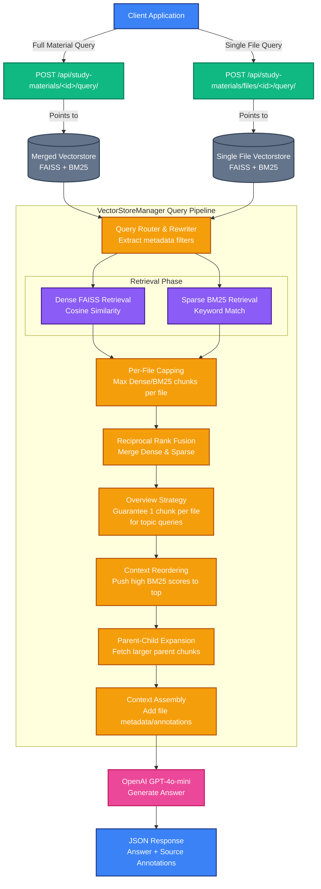

# Study Material RAG Architecture

This document diagrams the Retrieval-Augmented Generation (RAG) data flow for both whole Study Materials and individual Study Material Files.

## RAG Flow Diagram

## Key Differences

1. **Target Vectorstore**:
   - The **Whole Study Material** endpoint queries the merged vectorstore located at `sm.vectorstore_location` which contains embeddings from all files in the zip.
   - The **Single File** endpoint queries the specific file's vectorstore located at `smf.vectorstore_path`, completely isolating its results from the rest of the material.
   
2. **Overview Strategy Impact**:
   - During a whole study material query, if the user asks an "overview" question (e.g. "what topics are covered?"), the `VectorStoreManager` will boost `k` and inject a guaranteed 1 chunk from each small file to ensure all topics are represented.
   - For a single file query, this overview logic is still executed but applies only to the chunks within that single file, naturally resulting in broad coverage of that specific document.

3. **Context Length Constraints**:
   - The whole study material query actively utilizes the `MAX_DENSE_PER_FILE` and `MAX_BM25_PER_FILE` caps (currently 2 chunks per file) to prevent a single large document (like a massive CSV) from starving smaller documents in the RAG context.
   - The single file query hits these same caps, but since only one file is present in the vectorstore, the total context returned to the LLM is more focused on deep extraction from that single document.
